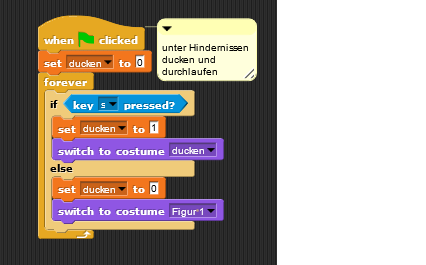
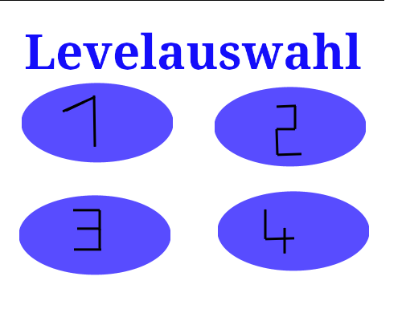
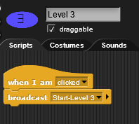
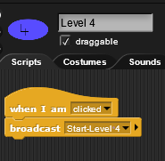

# Informatik-Projekt
### Inhaltsverzeichnis
<li><a href="#kapitel1">1. Über uns</a></h2></li>
<li><a href="#kapitel1">2. Stundenprotokolle</a></h2></li>

  <ul style="list-stlye-type:none">
  <li><a href="#kapitel1">16.08.2022</a></h3></li>
   

<li><a href="#kapitel1">3. Projekt</a></h2></li>
<li><a href="#kapitel1">4. Reflexion</a></h2></li>

<h2 id="kapitel1">1. Über uns</h2>

Wir sind Bente Rosenthal und Jana Sophie Schümann aus der 12bfg. Wir sind im Biologie- und Geschichtsprofil und hoffen, dass wir auch ohne jegliche Vorkenntnisse im Bezug auf Programmieren ein gutes Projekt gestalten und abliefern können.

<h2 id="kapitel1">2. Stundenprotokolle</h2>

### 16.08.2022 
Heute war unsere erste Informatikstunde, in welcher wir erfahren haben, wie der Informatik-Unterricht aufgebaut sein wird und was unsere Aufgaben sein werden. Unsere Aufgaben werden sein, ein Projekt zu programmieren und ein Stundenprotokoll zu erstellen, welche dann benotet werden und zu einem großen Teil unsere Endnote bilden. Danach hat Herr Buhl uns verschiedene Projekte von ehemaligen SchülerInnen gezeigt, damit wir eine bessere und genauere Vorstellung davon bekommen, was im Informatikunterricht alles möglich ist und was man erreichen kann. Anschließend haben wir uns mit Github vertraut gemacht und die ersten Profile wurden erstellt, damit wir bei diesem Programm unsere Stundenprotokolle führen können und am Ende dort unser Projekt hinterlegen können. 

### 17.08.2022
Heute haben wir uns mit dem Umgang mit "Github" beschäftigt und uns dazu viele verschiedene Stundentagebücher von ehemaligen Schülern angeschaut, um zugucken, welches Design uns am besten gefällt und wie wir unser eigenes Stundenprotokoll und unsere eigene Projektseite gestalten können. Anschließend haben wir dann verschiedene Möglichkeiten für das Layout unseres eigenen Stundenprotokolles ausprobiert und uns zusätzlich mit "Markdown" vertraut gemacht, um eine Vielfalt in unsere Protokolle zubringen. Erste Gedanken zu unserem Projekt haben wir uns ebenfalls schon gemacht und sind zu dem Schluss gekommen, dass wir wahrscheinlich ein 2D-Spiel mit "Snap!" gestalten möchten. Was für eine Art von Spiel beziehungweise welchen Aufbau dieses haben soll, wissen wir jedoch noch nicht und werden in den nächsten Stunden daran arbeiten.

Versuche mit Markdown

Link einfügen:
[Google](https://www.google.com)
  
Tabelle erstellen:
| Tabelle | erstellen |
| ------- | :-------: |
| mit     | Markdown  |

### 23.08.2022
Heute haben wir erste Sachen mit "Snap!" ausprobiert, um uns in diesem Programm zu orientieren und um erste Ideen zusammeln, wie wir unser 2D-Spiel umsetzen können. Damit unsere Figur sich bewegen kann, haben wir festgelegt, welche Tasten gedrückt werden müssen, damit sie sich nach oben, unten, rechts oder links bewegt. Um immer wieder auf unser Projekt zugreifen zu können, haben wir uns einen Account bei "Snap!" erstellt, unser Projekt gespeichert und mit der Hilfe von Herrn Buhl unseren ersten Screenshot von unseren Fortschritten in das Stundenprotokoll eingefügt. 

Arbeit mit "Snap!"

["Snap!"](https://snap.berkeley.edu/snap/snap.html)

Programmierung Figur 1
  

### 24.08.2022
Heute haben wir uns weiter mit "Snap!" beschäftigt, leider waren unsere Ergebnisse von der letzten Stunde, trotz speichern, nicht mehr auf dem PC, weshalb wir noch einmal von vorne anfangen mussten. Wir haben noch eine zweite Spielfigur erstellt, uns damit beschäftigt wie man Hintergründe gestalten kann und verschiedene Arten von Sprüngen programmiert. Außerdem haben wir uns Gedanken über unser 2D-Spiel gemacht, zum Beispiel haben wir uns überlegt, dass es zwei verschiedene Landschaften geben soll mit verschieden schweren Leveln. Unsere Spielfiguren sollen in einem "Jump and Run" Spiel gegeneinander antreten, Hindernisse überwinden und am Ende am Ziel ankommen. Am Ende der Stunde haben wir uns dann mit dem richtigen Speichern von den erten Fortschritten unseres Projektes beschäftigt und hoffen, dass es diesmal geklappt hat und wir nicht noch einmal von vorne anfangen müssen.

Arbeit mit "Snap!"

Programmierung Figur 2
  

### 30.08.2022
Leider haben wir heute wieder einen leeren Account bei "Snap!" vorgefunden und dachten für einen kurzen Moment, dass wir wieder komplett von vorne anfangen müssen. Zum Glück haben wir dann aber nach langem Ausprobieren und Suchen, unser Projekt öffnen und bearbeiten können, sodass nicht alles von vorne angefangen werden muss. Da wir ein "Jump and Run" Spiel gestalten möchten, haben wir heute recherchiert, wie wir die Hindernisse programmieren können, sodass die Figuren darauf landen und nicht hindurchgehen können. Dazu haben wir uns Beispiele aus dem Internet und das "Mirror-Game" angeschaut.

### 31.08.2022
Heute haben wir uns weiterhin damit beschäftigt, einen Untergrund für unsere Figuren zu gestalten, damit sie nicht aus dem Bildschirm fallen, sondern die ganze Zeit zu sehen sind. Im Internet haben wir recherchiert, jedoch keine hilfreichen Informationen gefunden, weshalb Herr Buhl uns als Hilfestellung ein Projekt mit einem Abenteuer Spiel rausgesucht hat. Mit Hilfe des Abenteuerspielshätten wir eventuell einen Ansatz bekommen können, wie unsere Figur nicht mehr aus dem Bild fallen kann - unsere zweite Figur haben wir erst einmal gelöscht, damit wir uns auf eine Figur konzentrieren können und das Spiel fertig bekommen und am Ende, wenn wir noch Zeit haben, dann noch eine zweite Figur hinzufügen und programmieren können. Leider hat auch die Programmierung des Abenteuerspiels bei uns nicht funktioniert, weshalb wir in dem Aspekt immer noch nicht weiter gekommen sind. Dank der Hilfe von Juliane haben wir es am Ende der Stunde dann doch noch geschafft, unsere Figur vom festen Boden auf ein Hindernis springen zu lassen, ohne dass sie durch das Hindernis durchfällt oder aus dem Bild verschwindet, zwar auf eine andere und womöglich kompliziertere Art und Weise, aber eine die für uns funktioniert. Nun erstellen wir unsere Hindernisse als Spielfiguren, die sich aber nicht bewegen, sondern in den Hintergrund integriert sind.

Arbeit mit "Snap!"

### 06.09.2022
Heute haben wir uns damit beschäftigt, dass unsere Figur sich unter Hindernissen hindurch ducken kann. Hierfür haben wir ein neues "Costume" für unsere Figur erstellt und uns damit beschäftigt eigene Variablen zu erstellen. Anschließend haben wir die Variable "ducken" erstellt und den dazugehörigen Befehlsblock erstellt. Unser Screenshot konnte leider über Firefox nicht in unserem "Read Me" hochgeladen werden, weshalb wir dann nochmal alles neu über Chrome machen mussten. Dort hat es dann aber zum Glück funktioniert und wir konnten den Screenshot hochladen und ins "Read Me" einfügen.

Arbeit mit "Snap!"

### 07.09.2022
Heute haben wir bei Snap die Variable "Sprung an" kreiert. Anschließend haben wir uns noch mit den Erstellen eines Befehles für Gravitation beschäftigt und es geschafft dies umzusetzen. Außerdem haben wir uns eine Möglichkeit übrlegt, dass unsere Figur nicht von unten durch die Ebenen hindurchspringen kann, sondern durch die Gravitation wieder auf dem Boden landet. Hinzu kommt das Programmieren eines Startbildschirmes für unser "Jump and Run"-Spiel. Dabei haben wir programmiert, dass sich alle Figueren des Spiels außer der Startknopf "verstecken", wenn das Spiel gestartet wird. Leider haben wir es nicht geschafft, dass alle wieder erscheinen sobald der Startknopf gedrückt wird, weshalb wir die Programmierung erstmal mit der Leertaste vorgenommen haben, sodass sich der Startknopf "versteckt" und alle anderen Figuren erscheinen. Da Herr Buhl heute nicht da war, haben wir uns Hilfe bei dem "Mirror-Game" von ehemaligen Schülern gesucht, indem wir uns deren Projektseite inklusive Erklärungen angeschaut haben.

Arbeit mit "Snap!"

Variable für unseren Sprung und Gravitation 

Programmierung dafür, dass die Figur nicht von unten durch die Hindernisse durchspringen kann und von oben nicht durchfällt und Festlegung der Startposition unsere Figur
  

Programmierung für den Wechsel zwischen Startbildschirm und Spiel

### 13.09.2022
Heute war Bente krank, weshalb Jana alleine die Kommentare an unsere Befehlsblöcke hinzugefügt hat. Ebenso wurde heute an dem Layout unseres Stundenprotokolls gearbeitet und schonmal angefangen, unsere Unterüberschrift "Projekt" anzulegen und mit Inhalt zufüllen, damit man in der nächsten Stunde hoffentlich zusammen an unserem Projekt und den kleinen Problemen, die es noch zulösen gilt, arbeiten. Hierbei war es für Jana wichtig, dass Fortschritte zu zweit erzielt werden, da es immer noch eine Gruppenarbeit ist und jedes Mitglied der Gruppe weiß, wie welche Programmierung zustande kam und welche Auswirkungen sie nun auf unser Spiel hat. 

Arbeit mit "Snap!"

  

### 14.09.2022
Heute war Bente immer noch krank und Jana hat alleine weiter an dem Projekt gearbeitet. Zuerst hat Jana sich mit "Gimp" vertraut gemacht, einem Programm, mit dem man Hintergründe gestalten und dann bei "Snap!" als "Stage" einfügen kann. Dafür hat Herr Buhl ihr erklärt, wie das Programm funktioniert und welche Funktionen es gibt. Anschließend wurde nun endlich das Problem mit dem Startknopf gelöst, sodass man nun mit dem Mauscurser draufklicken kann und sich die "Stage" ändert. Dementsprechend musste dann die "Stage" umprogrammiert werden, damit man nun auch durch klicken die Hintergründe wechseln kann. Außerdem wurde auch noch die "Stage" Levelauswahl mit "Gimp" gestaltet und die 4 Level "Sprites" entsprechend des Startknopfes programmiert. Die 4 Level "Stages" wurden ebenfalls angelegt, jedoch ist bisher erst das erste mit Hindernissen ausgestattet. Hier wurden dann auch noch die Hindernisse optimiert, sodass sie die gleiche Farbe haben und die obere und untere Ebene nun genau übereinander liegen. Dadurch, dass heute eine Doppelstunde war, musste Jana in "Snap!" weiterarbeiten und den Plan von gestern, keinen Fortschritt ohne Bente zu erzielen, da es eine Gruppenarbeit ist, verwerfen und an dem Projekt weiterarbeiten. Am Ende der Doppelstunde wurde dann noch im "ReadMe" weitergeschrieben und an dem Unterpunkt Projekt weitergearbeitet.

Arbeit mit "Snap!"

  
Programmierung unserer "Stage"

Startbildschirm mit "Gimp" gestaltet
  

  
Levelauswahhl mit "Gimp" gestaltet
  

  
Programmierung Startknopf
  

  
Programmierung Level 1 Button
  

  
Programmierung Level 2 Button
  

  
Programmierung Level 3 Button
  

  
Programmierung Level 4 Button
  

### 20.09.2022
Heute konnten wir leider nicht an unserem Projekt weiterarbeiten, da wir in Prag auf Studienfahrt sind.

### 21.09.2022
Heute konnten wir leider nicht an unserem Projekt weiterarbeiten, da wir in Prag auf Studienfahrt sind.

<h2 id="kapitel1">3. Projekt</h2>

### Programm

Für unser Projekt haben wir "Snap!" genutzt, da dieses Programm gerade für Anfänger gut geeignet und einfach zu verstehen ist. Bei "Snap!" wird keine Programmiersprache genutzt, sondern Bausteine, auf denen in Englisch steht, was passieren soll, wenn sie zusammengesetzt werden. Für Anfänger ist gerade dies von Vorteil, da man sich nicht erst in die Programmiersprache einarbeiten muss, sondern direkt anfangen kann und die Herausforderung "nur" ist, die Bausteine richtig zu kombinieren, um den gewünschten Befehl auszuführen.

### Idee
Unsere Grundidee basiert auf einem "Jump and Run"-Spiel, in welchem eine Figur in mehreren Leveln Hindernisse überwinden und zum Ziel gelangen muss. Hierbei ist es uns wichtig, dass die Figur weder von unten durch die Hindernisse hindurch darauf springen kann noch von einem Hindernis zum nächsten Hindrnis in der Luft laufen kann. Es muss also eine Schwerkraft oder Gravitationskraft erstellt werden, genauso wie undurchdringbare Hindernisse.

verworfene Ideen

- 2D-Spiel: Labyrinth --> Tierpaare müssen sich gegenseitig finden 
- 2D-Spiel: Irrgarten --> farbige Kugel müssen durch ein Wirrwarr von Wegen den richtigen Weg in das Rohr ihrer eigenen Farbe finden

<h2 id="kapitel1">4. Reflexion</h2> 
Rückblickend lässt sich sagen, dass wir  sehr gut mit dem Programm "Snap!" zurechtgekommen sind und es Spaß gemacht hat, etwas Eigenes zu programmieren und am Ende auch zusehen, dass man etwas geschaffen hat.
